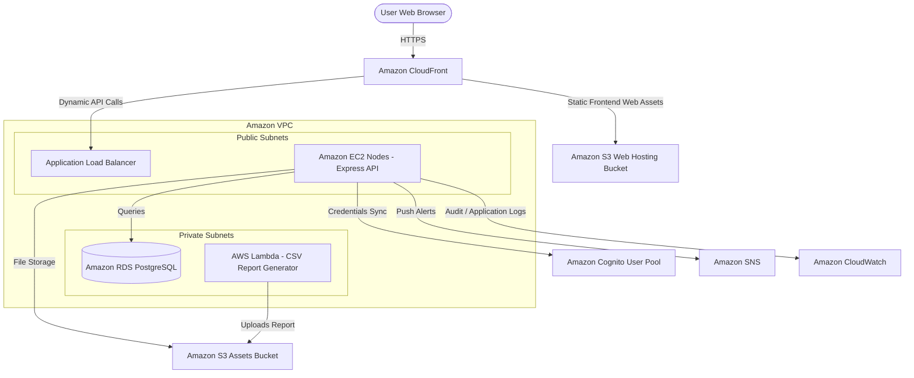

# FUTURE AWS ARCHITECTURE MIGRATION MAPPING

This document provides a comprehensive blueprint mapping local stack elements to their respective AWS cloud services for Phase 2.

## Local vs. AWS Mapping Table

| Local Component | Local Technology | Future AWS Service | Migration Strategy |
| :--- | :--- | :--- | :--- |
| **Backend Compute** | Node.js Express server running locally | **Amazon EC2** | Deploy the Node.js application directly to an Amazon EC2 instance, managed by PM2 process manager and reverse-proxied using Nginx. |
| **Database** | PostgreSQL running locally | **Amazon RDS (PostgreSQL Engine)** | Restore the local schema from SQL dumps or trigger Prisma migrations against the RDS endpoint. |
| **File Storage** | `backend/uploads/` local directory | **Amazon S3** | Switch `StorageService` implementation to `S3StorageService` using AWS SDK (`@aws-sdk/client-s3`). |
| **Authentication** | JWT with local bcrypt check in DB | **Amazon Cognito User Pools** | Move auth queries to Cognito User Pool, using JWT verification against Cognito JWKS endpoints. |
| **Notifications** | Relational `notifications` table | **Amazon SNS (Simple Notification Service)** | Trigger SMS or email updates using SNS SDK endpoints for alert broadcasts. |
| **Background Jobs** | Node.js execution threads | **AWS Lambda** | Relocate reports generation and automated cron tasks to serverless lambda functions. |
| **Server Logging** | Console logging | **Amazon CloudWatch** | Pipe application logs to CloudWatch logs group for real-time monitoring and alarms. |
| **Networking** | localhost | **Amazon VPC** | House database (RDS) in private subnets and API nodes in public subnets with Security Groups. |

## Future AWS Deployment Architecture



## Detailed Component Transformations

### 1. Storage Abstraction (S3 Integration)
In Phase 1, `StorageService` is implemented by `LocalStorageService`. In Phase 2, we will create `S3StorageService` using:
```typescript
import { S3Client, PutObjectCommand } from "@aws-sdk/client-s3";
// Implement S3 upload, exists, delete methods...
```
Because controllers query the `StorageService` interface, no API endpoints will require refactoring.

### 2. User Authentication (Cognito Integration)
Cognito User Pools will store student and faculty accounts.
* Frontend will integrate with Cognito Hosted UI or AWS Amplify SDK.
* Backend `authenticate` middleware will download Cognito JSON Web Keys (JWK) and verify the token signature locally, checking roles inside token custom claims (e.g. `custom:role`).

### 3. Server Logging (CloudWatch Integration)
Local console logs will be piped directly to CloudWatch logs via an AWS CloudWatch Log Agent running on EC2, or by implementing a Winston CloudWatch transport in the logger service.
