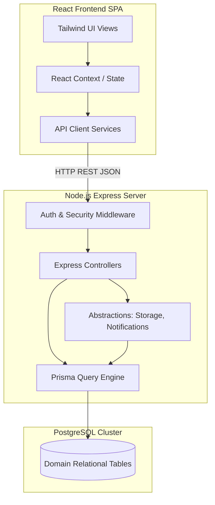

# System Architecture Document

This document outlines the architecture, layout, and components of the College Campus Management System.

## Overall Application Architecture

The application is structured as a modern, decoupled client-server architecture. The backend exposes a RESTful JSON API, and the frontend is a single-page application (SPA) built using React.



## Layered Design Pattern

The backend is built following a clean, layered architecture:

```text
Route Layer (URL Mapping & Params Definition)
      ↓
Controller Layer (HTTP payload parse, Validation & Response formatting)
      ↓
Service Layer (Abstractions: File upload, Audit logs, Password utils)
      ↓
ORM / Database Layer (Prisma query executor)
      ↓
PostgreSQL Relational Storage
```

1. **Route Layer**: Resolves endpoints (e.g. `/api/student/dashboard`) and routes requests to appropriate controllers. Attaches security and authentication check middlewares.
2. **Controller Layer**: Inspects incoming express headers/cookies, validates the shape of body objects using Zod validation schemas, handles error catch-blocks, and sends unified JSON response structures.
3. **Service Layer**: Implements domain business logic and abstract utilities.
4. **ORM / Database Layer**: Interacts with PostgreSQL using Prisma ORM.

## Local Services Abstraction

To ensure future cloud readiness, we decouple application code from local environment dependencies using service abstractions:

* **StorageService**: All file uploads (assignments and documents) are handled via the `StorageService` interface. The local implementation `LocalStorageService` writes files to `backend/uploads/` and serves them statically. In Phase 2, this will be replaced by `S3StorageService` without modifying controllers.
* **NotificationService**: In-app notifications are stored in the relational database. In Phase 2, this service will trigger `Amazon SNS` to push notifications to mobile/email endpoints.
* **AuthenticationService**: Decoupled JWT credential checking. In Phase 2, Cognito SDK calls can replace database queries.
